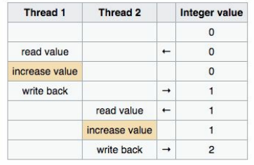
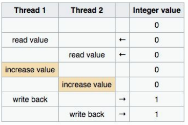

# PyHades
A python library to develop continuous tasks using concurrency sync or async

## Why you should use PyHades?

Imagine that you have 2 functions that you want to run like [daemons](https://en.wikipedia.org/wiki/Daemon_(computing))

```python
import time

def func1():
    
    while True:

        print("func1 running")
        time.sleep(1)

def func2():

    while True:

        print("func2 running")
        time.sleep(1)
```

You run these functions when run a main function.

```python
def main():
    
    func1()
    func2()

if __name__=='__main__':

    main()
```

Here you already have a problem, the *func2* is unreachable due to the blocking behavior of the *func1*.

PyHades solves to you this problem using multithreading in an easy and declarative way without blocking behavior.

```python
from pyhades import PyHades

app = PyHades()

@app.thread(period=1.0)
def func1():
    
    print("func1 running")

@app.thread(period=1.0)
def func2():

    print("func2 running")
    
if __name__=='__main__':

    app.run()
```

## Don't worry about the [GIL](https://realpython.com/python-gil/#:~:text=The%20Python%20Global%20Interpreter%20Lock%20or%20GIL%2C%20in%20simple%20words,at%20any%20point%20in%20time.)

The impact of the GIL isn’t visible to developers who execute single-threaded programs, but it can be a performance bottleneck in CPU-bound and multi-threaded code.

When it comes to multithreading, there are problems that need to be solved, that can be financially impactful, difficult to debug, and non-trivial for developers.

One of the most famous problem to be solved are [race conditions](https://stackoverflow.com/questions/34510/what-is-a-race-condition).

Let me cite an example from the literature *Learning concurrency in Python: Speed up your python code with clean, readable, and advanced concurrency techniques: Elliot Forbes.* That seems to me very important to understand how dangerous it could be
don't keep in mind race conditions.

*We imagine writing a banking application that updates your account balance whenever you deposit or withdraw any money from that account.*

*Imagine, we started with $2.000 in our bank account, and say we are about to receive a bonus of $5.000, because we managed to bug fix a concurrency issue in work was costing the business millions. Now also imagine that you are also to pay a rent of $1.000 on the same day.*

*If our banking application had two processes, one of which dealt with the witdrawing, Process A, and the other wich dealt with the depositing, Process B. Say Process B, which deals with deposits into your account, reads your bank balance as $2.000. If Process A was to start its withdrawal for the rent just after Process B starts its transaction, it would see the starting balance as $2.000. Process B would then complete its transaction, and correctly add $5.000 to our starting $2.000, and we'd be left with the grand sum of $7.000.*

*However, since Process A started its transaction thinking that the satrting balance was $2.000, it would unwittingly leave us bonus-less when it updates our final bank balance to $1.000. This is a prime example of a race condition within our software, and it's a very real danger always waiting to strike us in the most unfortunate ways.*

So, **this problem is solved with PyHades with its read/write methods in a safe-thread mechanism.** 

Let's take a look at what happened in closer detail. If we look at the following table, we'll see the ideal flow of execution for both Process A and Process B:



However, due to the fact we haven't implemented proper synchronization mechanisms to protect our account balance, Process A and Process B actually followed the following execution path and gave us an erroneous result:



___
## Installation
You can install PyHades from PyPi
```python
pip install PyHades
```
___
# Usage
PyHades is based on Singleton Pattern, so you can instantiate it anywhere in your app and it will keep its reference and be the same object throughout your app.

```python
from pyhades import PyHades

app = PyHades()
```
___
## Making Threads
PyHades uses [ThreadPoolExecutor](https://docs.python.org/3/library/concurrent.futures.html#concurrent.futures.ThreadPoolExecutor), so, you can define communication threads asynchronously easily using the *thread* decorator.

```python
from pyhades import PyHades

app = PyHades()

@app.thread(period=0.5)
def say_hi():

    print('Hi with 0.5s period')

@app.thread
def say_hello():

    print('Hello with 1s period')
```

## Running Threads
Finally, to run your threads, you must call the *run* method of your app.

```python
app.run()
```
___
## OPCUA Client Threads
You can also evaluate the number of tags you can query an OPC UA server based on the time period you use executing the thread.

This example is based on the library [opcua](https://pypi.org/project/opcua/)

```python
from opcua import Client
from opcua.ua.uatypes import NodeId
from pyhades import PyHades

app = PyHades()

prosys_server = 'opc.tcp://uademo.prosysopc.com:53530/OPCUA/SimulationServer'
opcua_client = Client(prosys_server)
opcua_client.connect()
node_ids = ['ns=3;i=1001', 'ns=3;i=1002', 'ns=3;i=1003', 'ns=3;i=1004', 'ns=3;i=1005', 'ns=3;i=1006']

@app.thread(period=0.1)
def get_node_id_value():
    r"""
    Documentation here
    """
    result = list()
    for node_id in node_ids:
        _node = opcua_client.get_node(NodeId.from_string(node_id))
        value = _node.get_value()
        result.append(value)

    print(result)

if __name__=='__main__':

    app.run()
```
___
## State Machines
You can also create your own classes using the [state machine](https://en.wikipedia.org/wiki/State_pattern#:~:text=The%20state%20pattern%20is%20a,concept%20of%20finite%2Dstate%20machines.) design pattern on a simple way.

```python
from pyhades import PyHades, PyHadesStateMachine, State

app = PyHades()

@app.define_machine(name='TrafficLight', interval=1.0, mode="async")
class TrafficLightMachine(PyHadesStateMachine):

    # states
    green  = State('Green', initial=True)
    yellow  = State('Yellow')
    red  = State('Red')

    # transitions
    slowdown = green.to(yellow)
    stop = yellow.to(red)
    go = red.to(green)

    # parameters
    time_left = 30

    def __init__(self, name):

        super().__init__(name)

    def on_slowdown(self):

        self.time_left = 3

    def on_stop(self):

        self.time_left = 20

    def on_go(self):

        self.time_left = 30

    def while_green(self):

        print(self)
        if self.time_left == 0:

            self.slowdown()

        self.time_left -= 1

    def while_yellow(self):

        print(self)
        if self.time_left == 0:

            self.stop()

        self.time_left -= 1

    def while_red(self):

        print(self)
        if self.time_left == 0:

            self.go()
        
        self.time_left -= 1

    def __str__(self):

        return f"{self.name}: {self.get_state()} - {self.time_left} second left."

if __name__=='__main__':

    app.run()
```
___
## Source code

You can check the latest sources on [GitHub](https://github.com/know-ai/hades):

___
## Documentation

The official documentation can be found in [Read the Docs](https://hades.readthedocs.io/en/latest/)