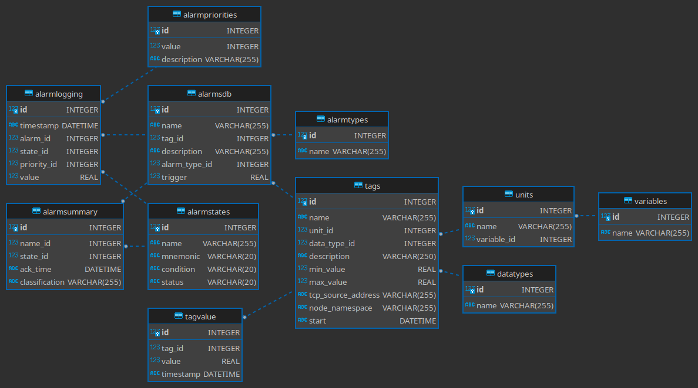

# Database Models

The entity relational diagram for PyHades database models is shown as follow:

PyHades has the following tables:

- Tags: It stores the information to define tags.
- TagValue: It stores the timeserie database for historian.
- DataTypes.
- Units.
- Variables.
- AlarmsDB: It stores the information to define alarms.
- AlarmLogging: Log all alarm triggered and when it changes of state.
- AlarmSummary: It stores the alarm life cycle.
- AlarmPriority.
- AlarmStates.
- AlarmTypes.

