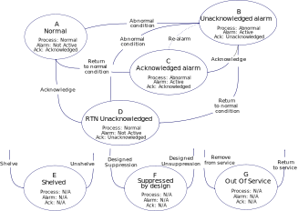

# Alarm Management System (AMS)

## Introduction

The primary function within the alarm system is to notify operators fo abnormal process conditions or equipment malfunctions and support the response. The alarm management system states can be represented by the following state diagram of the ISA 18.2 standard.




## Making an AMS

This is not a rigorous alarm management system, it is simply a kind of system that allows you to simulate how a continuous process allows you to monitor some variables to which certain alarms have been subscribed to monitor their status; however, this can be the basis for building a real alarm management system based on the standard ISA 18.2

Therefore, extending the previous case study on the data acquisition system, we add the functionality of declaring alarms to monitor variables.

To prepare the OPC UA server and client, see sections *Running Prosys OPC Server Simulator* and *Running Pronode OPCUA Client* in [DAS](https://hades.readthedocs.io/en/latest/user_guide_data_acquisition_system//)


```python
# alarm_management_system.py
from pyhades import PyHades, PyHadesStateMachine, State
from pyhades.tags import CVTEngine, TagBinding
from pyhades.alarms import Alarm, TriggerType
import requests
import os
import logging

# PyHades app definition
app = PyHades()
app.set_mode('Development')
app.set_db(dbfile="app.db")

# Tag Definitions
tag_engine = CVTEngine()
tag_engine.set_tag('Triangle', 'Adim.', 'int', 'Simulator triangle variable', -1, 1)

# Tag Definition on DB
interval = 1.0
app.set_dbtags(['Triangle'], interval)

# Alarm Definitions HH - H - L - LL
alarm1 = Alarm(name='Alarm-Triangle-HH', tag='Triangle', description='High High Triangle Value')
alarm1.set_trigger(value=0.8, _type=TriggerType.HH.value)
alarm1.tag_alarm = 'Alarm 1'
app.append_alarm(alarm1)


alarm2 = Alarm(name='Alarm-Triangle-H', tag='Triangle', description='High Triangle Value')
alarm2.set_trigger(value=0.5, _type=TriggerType.H.value)
alarm2.tag_alarm = 'Alarm 2'
app.append_alarm(alarm2)

alarm3 = Alarm(name='Alarm-Triangle-L', tag='Triangle', description='Low Triangle Value')
alarm3.set_trigger(value=-0.5, _type=TriggerType.L.value)
alarm3.tag_alarm = 'Alarm 3'
app.append_alarm(alarm3)

alarm4 = Alarm(name='Alarm-Triangle-LL', tag='Triangle', description='Low Low Triangle Value')
alarm4.set_trigger(value=-0.8, _type=TriggerType.LL.value)
alarm4.tag_alarm = 'Alarm 4'
app.append_alarm(alarm4)


@app.define_machine(name='DAS', interval=1.0, mode="async")
class DAS(PyHadesStateMachine):

    # State Definitions
    starting = State('Starting', initial=True)
    running = State('Running')

    # Transitions Definitions
    starting_to_running = starting.to(running)

    # Parameters
    triangle_var = TagBinding('Triangle', direction='write')

    # Alarm Manager
    alarm_manager = app.get_alarm_manager()

    def __init__(self, name):

        super().__init__(name)

    def while_starting(self):

        # Setting alarm object
        self.hh_alarm = self.alarm_manager.get_alarm('Alarm-Triangle-HH')
        self.h_alarm = self.alarm_manager.get_alarm('Alarm-Triangle-H')
        self.l_alarm = self.alarm_manager.get_alarm('Alarm-Triangle-L')
        self.ll_alarm = self.alarm_manager.get_alarm('Alarm-Triangle-LL')

        client_id = None
        self.opcua_client_url = "http://localhost:8001"
        # OPC_SERVER_URL = "opc.tcp://uademo.prosysopc.com:53530/OPCUA/SimulationServer"
        self.opcua_server_url = os.environ.get('OPC_SERVER_URL')

        # Connect with opcua server
        payload = {'url': self.opcua_server_url}
        response = requests.post(f'{self.opcua_client_url}/api/client/connect_to_server', json=payload)
        response = response.json()

        if response['is_connected']:
            
            client_id = response['id']

            self.client_id = client_id

            self.triangle_node_id = "ns=3;i=1006"

            self.starting_to_running()

    def while_running(self):

        # Reading Triangle Variable from opc ua client
        payload = {
            "namespace": self.triangle_node_id,
            "client_id": self.client_id
        }
        response = requests.post(f"{self.opcua_client_url}/api/client/node_attributes", json=payload)
        response = response.json()

        # Writing to Data Acquisition system Database (SQLite) for this demo
        self.triangle_var = response["Value"]

        print(f"High-High Alarm State: {self.hh_alarm.state.state} - Value: {self.hh_alarm.value} - Trigger Value: {self.hh_alarm.get_trigger().value}")
        print(f"High Alarm State: {self.h_alarm.state.state} - Value: {self.h_alarm.value} - Trigger Value: {self.h_alarm.get_trigger().value}")
        print(f"Low Alarm State: {self.l_alarm.state.state} - Value: {self.l_alarm.value} - Trigger Value: {self.l_alarm.get_trigger().value}")
        print(f"Low-Low Alarm State: {self.ll_alarm.state.state} - Value: {self.ll_alarm.value} - Trigger Value: {self.ll_alarm.get_trigger().value}")

    def disconnect_opc_client(self):

        try:
            url = f'{self.opcua_client_url}/api/client/disconnect/{self.client_id}'
            response = requests.get(url)
            resp = response.json()

            logging.info(f"Machine - {self.name}: {resp['message']}")
        except Exception as e:
            error = str(e)
            logging.error(f"Machine - {self.name}:{error}")


if __name__=="__main__":

    try: 
            
        app.run()

    except (KeyboardInterrupt, SystemExit):
        
        das = app.get_machine('DAS')
        das.disconnect_opc_client()
```

## Running PyHades AMS Service

At this point you already have a PyHades AMS code, just is missing run it.

If everything goes well so far, just is missing to declare the environment variable *OPC_SERVER_URL*, in this case, I am using Prosys OPC Server Simulator locally. So we can get its url in the Status section of the app, see teh following image.


Just, you must change the domain name by your ip address.

So, with the following command you can define your environment variable for linux

```
export OPC_SERVER_URL=opc.tcp://[ip_address]:53530/OPCUA/SimulationServer
```

For Windows

```
set OPC_SERVER_URL=opc.tcp://[ip_address]:53530/OPCUA/SimulationServer
```

After that you can run the service with

```
python3 alarm_management_system.py
```