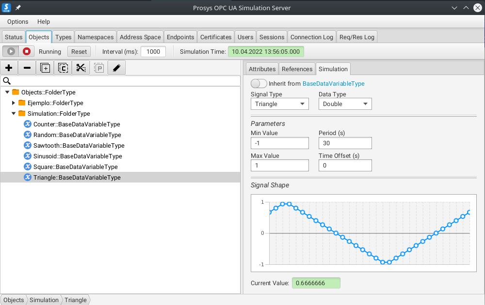
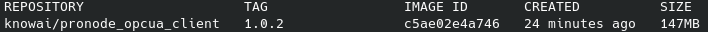
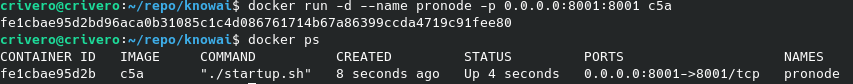
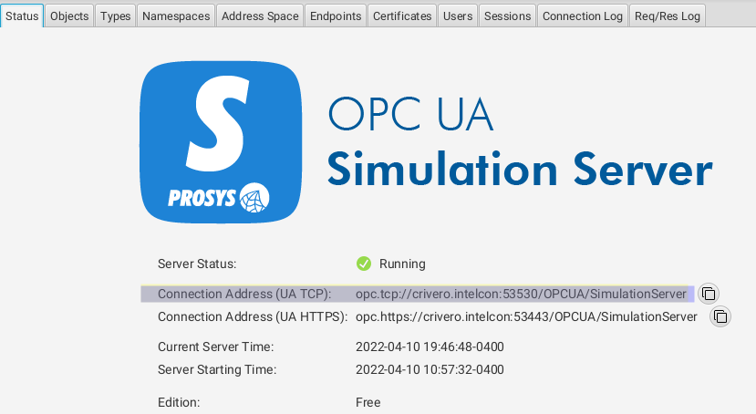
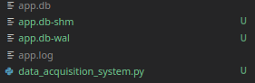
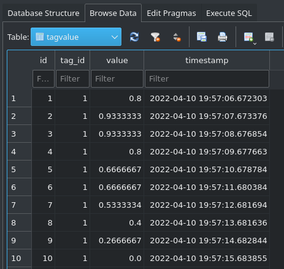

# Data Acquisition System (DAS)

## Introduction

[Data Acquisition](https://en.wikipedia.org/wiki/Data_acquisition) is the process of sampling signals that measure real world physical
conditions and converting the resulting samples into digital numeric values that can be manipulated by a computer.

In this opportunity let me show how to get and store data from an industrial server to work with that.

The goal of this case study is give you the tools to communicate with an industrial data server in a pythonic way using PyHades.

You can see the following architecture of the problem we want to solve


In the previous figure you can see that qthe factory expose an OPC UA Server and we want get that data and store it in an SQL database.

So, in this example I want to show you how to create the Data Acquisition System (PyHades DAS) and the database.

## Running Prosys OPC Server Simulator

In this case we are going to simulate the OPC UA Server with [Prosys OPC UA](https://www.prosysopc.com/products/opc-ua-simulation-server/), whereas the OPC UA communication will made with [Pronode OPC UA Client](https://hub.docker.com/r/knowai/pronode_opcua_client) *version 1.0.2*

So, we have installed the Prosys OPC Server Simulator locally, and we have the following server folder structure.



You also get a public prosys opc ua server in the following url: *opc.tcp://uademo.prosysopc.com:53530/OPCUA/SimulationServer*

So, the idea here is to create the PyHades DAS and its database, but firstly, you need you install [Pronode OPC UA Client](https://hub.docker.com/r/knowai/pronode_opcua_client) *version 1.0.2* whom works like a gateway beetween the opcua server an our application using a restful api.

## Running Pronode OPCUA Client

To download the Pronode OPCUA Client Docker images you must run:

```
docker pull knowai/pronode_opcua_client:1.0.2
```

After download it you must have the image locally and you can see it with the following command:

```
docker images
```



Then, you can run the service with the following command:

```
docker run -d --name [service_name] -p 0.0.0.0:[service_port]:8001 [IMAGE_ID]
```

Done this, you can see the service running with the following command:

```
docker ps
```

And must have a console like this.



## Making PyHades DAS Application

After run the Pronode OPCUA Client service, let me show how to create and run a minimalist Data Acquisition System made with PyHades

```python
# data_acquisition_system.py

from pyhades import PyHades, PyHadesStateMachine, State
from pyhades.tags import CVTEngine, TagBinding
import requests
import os
import logging

# PyHades app definition
app = PyHades()
app.set_mode('Development')
app.set_db(dbfile="app.db")

# Tag Definitions
tag_engine = CVTEngine()
tag_engine.set_tag('Triangle', 'Adim.', 'int', 'Simulator triangle variable', -1, 1)

# Tag Definition on DB
interval = 1.0
app.set_dbtags(['Triangle'], interval)

@app.define_machine(name='DAS', interval=1.0, mode="async")
class DAS(PyHadesStateMachine):

    # State Definitions
    starting = State('Starting', initial=True)
    running = State('Running')

    # Transitions Definitions
    starting_to_running = starting.to(running)

    # Parameters
    triangle_var = TagBinding('Triangle', direction='write')

    def __init__(self, name):

        super().__init__(name)

    def while_starting(self):

        client_id = None
        self.opcua_client_url = "http://localhost:8001"
        # OPC_SERVER_URL = "opc.tcp://uademo.prosysopc.com:53530/OPCUA/SimulationServer"
        self.opcua_server_url = os.environ.get('OPC_SERVER_URL')

        # Connect with opcua server
        payload = {'url': self.opcua_server_url}
        response = requests.post(f'{self.opcua_client_url}/api/client/connect_to_server', json=payload)
        response = response.json()

        if response['is_connected']:
            
            client_id = response['id']

            self.client_id = client_id

            self.triangle_node_id = "ns=3;i=1006"

            self.starting_to_running()

    def while_running(self):

        # Reading Triangle Variable from opc ua client
        payload = {
            "namespace": self.triangle_node_id,
            "client_id": self.client_id
        }
        response = requests.post(f"{self.opcua_client_url}/api/client/node_attributes", json=payload)
        response = response.json()

        # Writing to Data Acquisition system Database (SQLite) for this demo
        self.triangle_var = response["Value"]

    def disconnect_opc_client(self):

        try:
            url = f'{self.opcua_client_url}/api/client/disconnect/{self.client_id}'
            response = requests.get(url)
            resp = response.json()

            logging.info(f"Machine - {self.name}: {resp['message']}")
        except Exception as e:
            error = str(e)
            logging.error(f"Machine - {self.name}:{error}")


if __name__=="__main__":

    try: 
            
        app.run()

    except (KeyboardInterrupt, SystemExit):
        
        das = app.get_machine('DAS')
        das.disconnect_opc_client()
```

## Running PyHades DAS Service

At this point you already have a PyHades DAS code, just is missing run it.

If everything goes well so far, just is missing to declare the environment variable *OPC_SERVER_URL*, in this case, I am using Prosys OPC Server Simulator locally. So we can get its url in the Status section of the app, see teh following image.



Just, you must change the domain name by your ip address.

So, with the following command you can define your environment variable for linux

```
export OPC_SERVER_URL=opc.tcp://[ip_address]:53530/OPCUA/SimulationServer
```

For Windows

```
set OPC_SERVER_URL=opc.tcp://[ip_address]:53530/OPCUA/SimulationServer
```

After that you can run the service with

```
python3 data_acquisition_system.py
```

## Show Database of Data Acquisition System

when you run the code you have to create a .log and .db file



With whatever SQLite browser you can see your .db file, in this case we are going to use *sqlitebrowser*


In the Browse Data section, you can select Tag Trend Table to see all tags.


In Tag Value, you can se the history.

